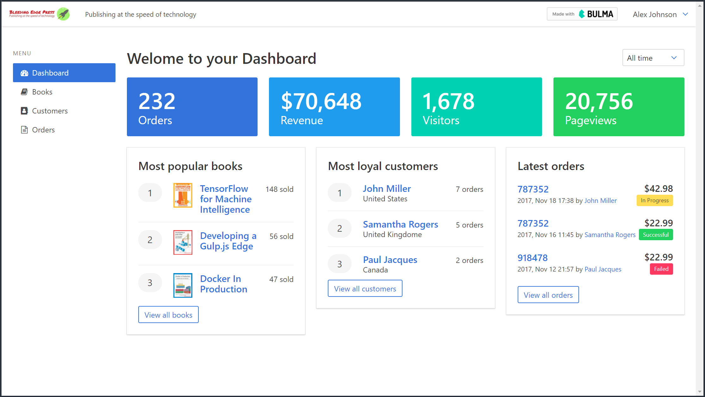

# Bulma Publishing Website using Angular
This Angular website was created using the project built in the book [Creating Interfaces with Bulma](https://bleedingedgepress.com/creating-interfaces-bulma/) written by **Jeremy Thomas**, the creator of Bulma, Oleksii Potiekhin, Mikko Lauhakari, Aslam Shah, and David Berning.  I was delighted to be a part of this book's development as a technical reviewer.  Bulma is a 100% responsive, CSS-only framework based on CSS Flexbox with simple syntax for easy integration into web design and development projects.

<p align="center">
    
    <br>
    <a href="https://bulmapublishing.firebaseapp.com" target="_blank">Bulma Publishing Website</a>
</p>

## Versions Used
* [Angular v5.2.2 (CLI v1.6.6)](https://github.com/angular/angular-cli/blob/master/README.md)
* [Bulma CSS Framework v0.6.2](https://bulma.io/)

## Website Features
**This website was designed to showcase the features of Bulma using Angular to make it interactive.**  There is no persistent data storage (except for the login screen) or use of a database.  As a result, using the *Quick Add* feature in the `books`, `customers`, and `orders` pages can be used to generate webpage content, but may result in unintended behavior.  A list of the interactive elements of the website are listed below:

### General Features
* Navbar with an **interactive hamburger** when viewed on mobile devices
* Use of **modals** for profile, bug report, and confirm delete screens
* Dynamic use of **dropdowns** and **notifications**
* Responsive website design using Bulma

### Login Screen
* Fully functional login form with validation (no back-end so any username/password combination will work).  The `Bypass Login` button is present for your convenience.
* Email Validation
* Password Validation (must use password between 6-20 characters which contains at least one numeric digit, one uppercase, and one lowercase letter)
* Remember Me using localStorage (stores email/password so it does not have to be re-entered by the user at a later date)

### Books Page
* CRUD Operations (Create book shown only in the `console` as no database is used.  Use the `Quick Add` button to mimic this feature)
* Search by book title
* Sort by Most Recent, Title, Page Count, or ISBN
* Pagination of 6 books

### Customers Page
* CRUD Operations (Create customer shown only in the `console` as no database is used.  Use the `Quick Add` button to mimic this feature)
* Search by customer name
* Sort by name, email, country, and # of orders
* Pagination of 153 customers

### Orders Page
* Search by order #
* Sort by order #, customer, date, # of books, status, and total price
* Pagination of 33 orders

### Generation of Fake Data
* Fake customers and orders generated through [Faker](https://github.com/Marak/Faker.js).  Custom `faker.js` file provided if you would like to generate additional customers or orders.

# Cloning the Project for Personal Use
## Installation
1. Clone this repo `https://github.com/stanleyeosakul/bulma-publishing.git`
1. `cd` into the folder of the cloned repo
1. Run `yarn install` to install dependencies
1. Run `ng serve`, and navigate to `http://localhost:4200/`

## Deploying to Firebase
1. Run `ng build --prod`
1. Run `firebase init` and choose `Hosting`, follow the on-screen prompts.
1. Delete the `public` directory automatically generated by the Firebase CLI
1. Change `firebase.json` to
    ```
    {
        "hosting": {
            "public": "dist",
            "ignore": [
                "firebase.json",
                "**/.*",
                "**/node_modules/**"
            ],
            "rewrites": [
                {
                    "source": "**",
                    "destination": "/index.html"
                }
            ]
        }
    }
    ```
1. Run `firebase deploy`